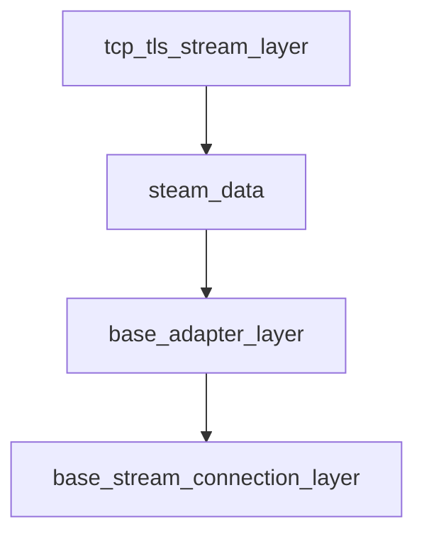

# TLS Wiki
## 重构背景
对于master 分支的fast_tcp_connection，其本身与packer/unpacker耦合紧密，没有办法发挥tcp协议本身基于stream的特点，我们希望通过重构，实现基于stream的tcp/tls连接，将stream流所承载的
protocol协议抽象出来，提供相关的开发接口，方便调用者自行定义，同时我们也提供了Agora通用的packet协议的解析，以及常用的http,websocket协议。

## 基本的概念解释
###
#### BaseStreamTransporter
virtual接口，提供基本的socket, fd等read/write接口，具体实现由子类TcpStreamTransporter, TlsStreamTransporter实现
#### BaseStreamConnection
virtual接口，提供通用的tcp_connection相关API，具体实现由子类FastTcpConnection, FastTlsConnection实现，
每一个BaseStreamConnection 包含一个StreamTransporter和一个BaseAdapter接口
#### PacketAdapter
virtual接口，接收StreamTransporter回调的StreamData, 进行具体的协议解析，具体实现由子类HttpAdapter, PacketAdapter, SwitchAdapter, DummyAdapter实现
#### FastTcpConnection/FastTlsConnection
master分支network/fast_tcp_connection的替换, 基于PacketAdapter的实现
#### FastTlsClient/FastTlsServer
基于FastTlsConnection实现的Client/Server
#### NewHttpConnection/WebSocketConnection
master分支http/http_connection的替换
#### GenericTlsConnection/GenericTlsClient
基于DummyAdapter解析的tls connection

## 整体架构的灵活性
从上述的概念解释可知，TcpStreamTransporter和TlsStreamTransporter实现了基本的tcp stream和tls stream的管理，并不涉及具体的协议解析，具体的protocol解析由抽象的BaseAdapter负责解析，
从而实现了任何的应用层协议都可以复用Tcp/Tls Transporter, 要实现一个新的应用层协议，只需要实现具体BaseAdapter和BaseStreamConnection

## 具体的调用关系

